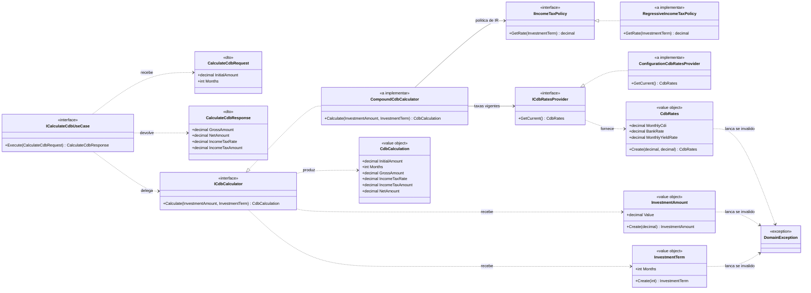

# Simulador de Investimentos — Cálculo de CDB

Solução única (`SimuladorInvestimentos.slnx`) com:

- **Web API** em .NET 10 (`src/backend`) — recebe valor e prazo, devolve o resultado bruto e
  líquido do investimento;
- **Web App** em Angular CLI 21 (`src/frontend/simulador-investimentos-web`) — tela para
  informar os dados e ver o resultado;
- **testes unitários** em xUnit v3 com cobertura medida na camada lógica (`tests/`).

Sem banco de dados nesta versão.

> **Estado: esqueleto.** A estrutura, os contratos, os objetos de valor e a esteira de
> qualidade estão prontos e compilando; o cálculo em si e o endpoint estão marcados como
> `TODO` no código.

## Regras de negócio

Rendimento de cada mês (o resultado de um mês é o valor inicial do mês seguinte):

```
VF = VI x [1 + (CDI x TB)]
```

| Parâmetro | Significado                     | Valor nesta versão |
| --------- | ------------------------------- | ------------------ |
| `VI`      | valor inicial                   | informado na tela  |
| `CDI`     | CDI do último mês               | 0,9% (`0.009`)     |
| `TB`      | quanto o banco paga sobre o CDI | 108% (`1.08`)      |

Imposto de renda sobre o **rendimento**, pela tabela regressiva:

| Prazo             | Alíquota |
| ----------------- | -------- |
| até 6 meses       | 22,5%    |
| até 12 meses      | 20%      |
| até 24 meses      | 17,5%    |
| acima de 24 meses | 15%      |

Entradas válidas: valor monetário **positivo** (até 2 casas decimais) e prazo em meses
**maior que 1**.

## Pré-requisitos

| Ferramenta                          | Versão                                   |
| ----------------------------------- | ---------------------------------------- |
| .NET SDK                            | 10.0.100 ou superior (`global.json`)     |
| Node.js                             | ^20.19 · ^22.12 · >= 24 (exigência do Angular 21) |
| Visual Studio 2022/2026             | com a carga "ASP.NET" e "Node.js" (para abrir o `.esproj`) |

## Como executar

### Backend (Web API)

```bash
dotnet restore SimuladorInvestimentos.slnx
dotnet run --project src/backend/SimuladorInvestimentos.Api --launch-profile http
```

- API: `http://localhost:5080`
- Health check: `http://localhost:5080/health`
- Contrato OpenAPI (ambiente Development): `http://localhost:5080/openapi/v1.json`

### Frontend (Angular)

```bash
cd src/frontend/simulador-investimentos-web
npm install
npm start
```

Tela em `http://localhost:4200`. O `proxy.conf.json` encaminha `/api` para
`http://localhost:5080`, então o front usa caminhos relativos — nada de URL fixa no código.

### No Visual Studio

Abra `SimuladorInvestimentos.slnx`, defina `SimuladorInvestimentos.Api` como projeto de
inicialização e rode; suba o front pelo `.esproj` (F5 executa `npm start`) ou pelo
terminal. O build da solução **não** compila o front (`ShouldRunBuildScript=false`) para
não deixar o `dotnet build` dependente do npm.

## Como testar

### Backend + cobertura

```bash
dotnet test SimuladorInvestimentos.slnx --settings coverage.runsettings --collect "XPlat Code Coverage"
```

O `coverage.runsettings` restringe a medição a `SimuladorInvestimentos.Domain` e
`SimuladorInvestimentos.Application` (critério de aceite: **acima de 90% na camada
lógica**). Para o relatório em HTML:

```bash
dotnet tool install --global dotnet-reportgenerator-globaltool
reportgenerator -reports:**/coverage.cobertura.xml -targetdir:coverage-report -reporttypes:Html
```

### Frontend (stretch)

```bash
cd src/frontend/simulador-investimentos-web
npm run test:ci        # Vitest, uma execução
npm run test:coverage   # com relatório de cobertura
```

## Arquitetura

Clean architecture / DDD tático, com o domínio no centro e dependências apontando para
dentro:

```
simulador-investimentos-web (Angular)
            │ HTTP
            ▼
SimuladorInvestimentos.Api  ──▶  SimuladorInvestimentos.Application  ──▶  SimuladorInvestimentos.Domain
(endpoints, DI, CORS,            (casos de uso, DTOs)                     (objetos de valor,
 ProblemDetails)                                                          políticas, cálculo)
```

| Camada                        | Responsabilidade                                                              |
| ----------------------------- | ----------------------------------------------------------------------------- |
| `Domain`                      | invariantes (valor positivo, prazo > 1 mês), fórmula do CDB e política de IR   |
| `Application`                 | orquestra o caso de uso e expõe o contrato da API (DTOs)                       |
| `Api`                         | transporte: rotas, serialização, CORS, tradução de erro de domínio em HTTP 400 |
| `simulador-investimentos-web` | apresentação: formulário, chamada HTTP e exibição do bruto/líquido             |

### Diagrama de classes (domínio e políticas)



### Políticas e princípios SOLID

| Princípio | Onde aparece                                                                            |
| --------- | --------------------------------------------------------------------------------------- |
| SRP       | cada classe tem um motivo para mudar: objeto de valor valida, política decide alíquota, calculadora compõe juros, caso de uso orquestra |
| OCP       | nova tabela de IR ou nova fonte de CDI entra como nova implementação de `IIncomeTaxPolicy` / `ICdbRatesProvider`, sem alterar o cálculo |
| LSP       | as implementações respeitam o contrato das interfaces (sem exigir estado extra ou lançar exceção não prevista) |
| ISP       | interfaces de um método, separadas por intenção, em vez de um "serviço de CDB" genérico |
| DIP       | domínio e aplicação dependem de abstrações; a API é o único lugar que conhece configuração e DI |

## Qualidade de código

- `Directory.Build.props` liga `EnableNETAnalyzers`, `AnalysisMode=Recommended`,
  `EnforceCodeStyleInBuild` e `TreatWarningsAsErrors`: **qualquer** alerta da análise nativa
  quebra o build.
- `SonarAnalyzer.CSharp` entra via `GlobalPackageReference` em todos os projetos .NET — as
  regras padrão do Sonar (as mesmas do SonarLint) valem no build, não só na IDE.
- Versões de pacote centralizadas em `Directory.Packages.props` (CPM).
- Front com Prettier (`.prettierrc`) e configuração `strict` do TypeScript herdada do
  Angular CLI.

## Observações sobre esta versão

- As versões de pacote em `Directory.Packages.props` (SonarAnalyzer, xUnit v3, Test SDK,
  coverlet) e o SDK do `.esproj` (`Microsoft.VisualStudio.JavaScript.Sdk`) foram fixadas
  sem acesso ao NuGet; se o `restore` reclamar de alguma, ajuste para a última versão
  estável disponível no seu feed.
- O `.gitignore` foi criado antes do primeiro build, de modo que nenhum artefato
  (`bin/`, `obj/`, `.vs/`, `TestResults/`) entra no controle de versão.
