# Simulador de Investimentos — Cálculo de CDB

Solução única (`SimuladorInvestimentos.slnx`) com:

- **Web API** em .NET 10 (`src/backend`) — recebe valor e prazo, devolve o resultado bruto e
  líquido do investimento;
- **Web App** em Angular CLI 21 (`src/frontend/simulador-investimentos-web`) — tela para
  informar os dados e ver o resultado;
- **testes unitários** em xUnit v3 com cobertura medida na camada lógica (`tests/`).

Sem banco de dados nesta versão.

> **Escopo desta versão:** cálculo de CDB pela API (`POST /api/v1/cdb/calculations`) e tela
> que o consome; taxas fixas em configuração e sem persistência.

## Regras de negócio

Rendimento de cada mês (o resultado de um mês é o valor inicial do mês seguinte):

```
VF = VI x [1 + (CDI x TB)]
```

| Parâmetro | Significado                     | Valor nesta versão |
| --------- | ------------------------------- | ------------------ |
| `VI`      | valor inicial                   | informado na tela  |
| `CDI`     | CDI do último mês               | 0,9% (`0.009`)     |
| `TB`      | quanto o banco paga sobre o CDI | 108% (`1.08`)      |

Imposto de renda sobre o **rendimento**, pela tabela regressiva:

| Prazo             | Alíquota |
| ----------------- | -------- |
| até 6 meses       | 22,5%    |
| até 12 meses      | 20%      |
| até 24 meses      | 17,5%    |
| acima de 24 meses | 15%      |

Entradas válidas: valor monetário **positivo** (até 2 casas decimais) e prazo em meses
**maior que 1**.

Arredondamento: o cálculo roda em `decimal` sem arredondar; bruto e imposto são arredondados
a 2 casas (`MidpointRounding.AwayFromZero`) só na resposta, e o líquido é bruto − imposto já
arredondados, para que os três valores fechem na tela. A alíquota sai como decimal (`0.2`),
sem arredondamento.

## Pré-requisitos

| Ferramenta                          | Versão                                   |
| ----------------------------------- | ---------------------------------------- |
| .NET SDK                            | 10.0.100 ou superior (`global.json`)     |
| Node.js                             | ^20.19 · ^22.12 · >= 24 (exigência do Angular 21) |
| Visual Studio 2022/2026             | com a carga "ASP.NET" e "Node.js" (para abrir o `.esproj`) |

## Como executar

### Backend (Web API)

```bash
dotnet restore SimuladorInvestimentos.slnx
dotnet run --project src/backend/SimuladorInvestimentos.Api --launch-profile http
```

- API: `http://localhost:5080`
- Health check: `http://localhost:5080/health`
- Cálculo: `POST http://localhost:5080/api/v1/cdb/calculations`
- Contrato OpenAPI (ambiente Development): `http://localhost:5080/openapi/v1.json`
- Interface de referência da API (Scalar, ambiente Development): `http://localhost:5080/scalar`

Exemplo de chamada (R$ 10.000 por 12 meses):

```bash
curl -s -X POST http://localhost:5080/api/v1/cdb/calculations \
  -H "Content-Type: application/json" \
  -d '{ "initialAmount": 10000, "months": 12 }'
```

```json
{ "grossAmount": 11230.82, "netAmount": 10984.66, "incomeTaxRate": 0.20, "incomeTaxAmount": 246.16 }
```

Entrada inválida (valor ≤ 0, mais de 2 casas decimais ou prazo ≤ 1) responde `400` com
`ProblemDetails` (`title: "Requisição inválida"`, `detail` com a mensagem do domínio). JSON
malformado ou tipo errado também responde `400`, sem `detail`. As mesmas requisições estão em
`src/backend/SimuladorInvestimentos.Api/SimuladorInvestimentos.Api.http` para rodar da IDE.

### Frontend (Angular)

```bash
cd src/frontend/simulador-investimentos-web
npm install
npm start            # ou: npm start -- --open  (abre o navegador automaticamente)
```

Tela em `http://localhost:4200`. O `proxy.conf.json` encaminha `/api` para
`http://localhost:5080`, então o front usa caminhos relativos — nada de URL fixa no código.

### No Visual Studio

1. Abra `SimuladorInvestimentos.slnx`.
2. Na lista de inicialização da barra de ferramentas, escolha o perfil **API + Web** (vem
   de `SimuladorInvestimentos.slnLaunch.user`, versionado de propósito).
3. Pressione **F5**. A API sobe com depurador em `http://localhost:5080` e o navegador abre
   automaticamente em `http://localhost:4200` (Edge por padrão; troque para
   "localhost (Chrome)" na lista de depuradores do `.esproj`).
4. Em um terminal, suba o dev-server do Angular:

   ```bash
   cd src/frontend/simulador-investimentos-web
   npm install
   npm start            # ou: npm start -- --open  (abre o navegador automaticamente)
   ```

5. Quando o terminal mostrar o servidor em `http://localhost:4200`, recarregue a página no
   navegador: o front carrega e já conversa com a API pelo `proxy.conf.json`.

Para subir só um dos lados, defina `SimuladorInvestimentos.Api` ou o `.esproj` como projeto
de inicialização. O build da solução **não** compila o front (`ShouldRunBuildScript=false`)
para não deixar o `dotnet build` dependente do npm.

## Como testar

### Backend + cobertura

Todos os comandos desta seção rodam na **raiz do repositório** (a pasta que contém
`SimuladorInvestimentos.slnx`), não em `src/backend`.

```bash
dotnet test SimuladorInvestimentos.slnx
```

Dois projetos de teste (xUnit v3), um por camada lógica:

| Projeto                                   | Cobre                                                        | Testes |
| ----------------------------------------- | ------------------------------------------------------------ | ------ |
| `tests/SimuladorInvestimentos.Domain.Tests`      | objetos de valor, `RegressiveIncomeTaxPolicy`, `CompoundCdbCalculator` | 55 |
| `tests/SimuladorInvestimentos.Application.Tests` | `CalculateCdbUseCase`, `CalculateCdbResponse.From` (arredondamento), `AddApplication()` | 19 |

O `Domain.Tests` valida a calculadora contra uma massa de referência (8 vetores de
valor/prazo com os quatro campos esperados na resposta) usando um fake próprio de
`ICdbRatesProvider` em `Support/`. O `Application.Tests` isola o caso de uso com um mock
estrito de `ICdbCalculator` (Moq), sem repetir a fórmula, e cobre o registro de
dependências.

A cobertura é coletada automaticamente pelo `coverlet.msbuild`, configurado em
`Directory.Build.targets` para todo projeto com `IsTestProject=true`. A medição fica
restrita a `SimuladorInvestimentos.Domain` e `SimuladorInvestimentos.Application`, e o
**quality gate roda no próprio build**: abaixo de **90% de linhas** na camada lógica o
`dotnet test` falha, sem depender de um servidor Sonar.

Cobertura de linhas atual: **94,8%** no `Domain` e **100%** na `Application`, com os 74
testes passando e o gate verde. As únicas linhas sem cobertura no `Domain` são as quatro
constantes `const decimal` de `RegressiveIncomeTaxPolicy`: o compilador as inicializa num
construtor estático que o coverlet não consegue registrar, então não é lacuna de teste (os
ramos de `GetRate` estão 100% cobertos). Subir o limiar para 100% faria o build falhar por
esse motivo; para conferir o gate na prática, `dotnet test -p:Threshold=100` termina com
`error : The total line coverage is below the specified 100`.

O relatório `coverage.cobertura.xml` sai em `TestResults/<projeto de teste>/`, na raiz
do repositório (o `Directory.Build.targets` fixa essa saída; não é a pasta `TestResults/`
que o `dotnet test` cria dentro de cada projeto).

Para ver o HTML, o atalho é o script da raiz, que roda os testes, gera o relatório e abre
`coverage-report/index.html` no navegador padrão:

```powershell
# uma vez por máquina: instala o comando `reportgenerator`
dotnet tool install --global dotnet-reportgenerator-globaltool

# na raiz do repositório
.\coverage.ps1           # testes + relatório + abre o navegador
.\coverage.ps1 -NoOpen   # só gera o relatório (CI)
```

Se o PowerShell bloquear o script por política de execução:
`powershell -ExecutionPolicy Bypass -File .\coverage.ps1`. O relatório é gerado mesmo quando
o gate falha, e o código de saída do script é o do `dotnet test`.

Os passos manuais equivalentes, também na raiz e depois de um `dotnet test`:

```bash
reportgenerator -reports:TestResults/**/coverage.cobertura.xml -targetdir:coverage-report -reporttypes:Html
```

O padrão de `-reports` é relativo à pasta atual: rodado de outro lugar (por exemplo
`src/backend`), o `reportgenerator` responde `found no matching files`. O resultado fica em
`coverage-report/index.html`, pasta ignorada pelo git.

Para uma rodada sem cobertura (mais rápida, sem o gate): `dotnet test /p:CollectCoverage=false`.

### Frontend

```bash
cd src/frontend/simulador-investimentos-web
npm run test:ci         # Vitest, uma execução (82 specs em 10 arquivos)
npm run test:coverage   # com relatório de cobertura
npm run e2e             # Playwright; sobe o ng serve se a porta 4200 estiver livre
```

Estrutura do front e detalhes dos testes E2E em
`src/frontend/simulador-investimentos-web/README.md`.

## Arquitetura

Clean Architecture simplificada em três projetos, com o domínio no centro e a regra de
dependência `Api → Application → Domain` (o domínio não referencia nada):

```
simulador-investimentos-web (Angular)
            │ HTTP
            ▼
SimuladorInvestimentos.Api  ──▶  SimuladorInvestimentos.Application  ──▶  SimuladorInvestimentos.Domain
(endpoints, adapters, DI,        (casos de uso, DTOs, DI)                 (objetos de valor,
 CORS, ProblemDetails)                                                    políticas, cálculo)
```

| Camada                        | Responsabilidade                                                              |
| ----------------------------- | ----------------------------------------------------------------------------- |
| `Domain`                      | invariantes (valor positivo, prazo > 1 mês), fórmula do CDB e política de IR   |
| `Application`                 | orquestra o caso de uso e expõe o contrato da API (DTOs)                       |
| `Api`                         | transporte: rotas, serialização, CORS, tradução de erro de domínio em HTTP 400 |
| `simulador-investimentos-web` | apresentação: formulário, chamada HTTP e exibição do bruto/líquido             |

### Estrutura de pastas

O namespace espelha a pasta. Nenhuma pasta nasce vazia; cada uma entra junto com o seu
primeiro arquivo.

```
src/backend/
├── SimuladorInvestimentos.Domain/
│   ├── Common/                                  vale para qualquer título de renda fixa
│   │   ├── Exceptions/DomainException.cs
│   │   ├── Tax/                                 IIncomeTaxPolicy, RegressiveIncomeTaxPolicy (tabela regressiva)
│   │   └── ValueObjects/                        InvestmentAmount, InvestmentTerm
│   └── Cdb/                                     específico do CDB
│       ├── Ports/ICdbRatesProvider.cs
│       ├── Services/                            ICdbCalculator, CompoundCdbCalculator (juros mês a mês + IR)
│       └── ValueObjects/                        CdbRates, CdbCalculation
│
├── SimuladorInvestimentos.Application/
│   ├── UseCases/
│   │   └── Cdb/
│   │       └── CalculateCdb/
│   │           ├── CalculateCdbRequest.cs
│   │           ├── CalculateCdbResponse.cs      From(CdbCalculation): mapeamento + arredondamento a 2 casas
│   │           ├── ICalculateCdbUseCase.cs      contrato que o endpoint consome
│   │           └── CalculateCdbUseCase.cs       cria os objetos de valor e delega a ICdbCalculator
│   └── DependencyInjection.cs                   AddApplication(): política, calculadora e caso de uso
│
└── SimuladorInvestimentos.Api/
    ├── Adapters/                                CdbRatesOptions (bind de "CdbRates"), ConfigurationCdbRatesProvider
    ├── Endpoints/CdbEndpoints.cs                MapGroup("/api/v1/cdb") + POST /calculations
    ├── ExceptionHandling/
    │   └── DomainExceptionHandler.cs            DomainException → HTTP 400 + ProblemDetails
    ├── DependencyInjection.cs                   AddApi(configuration): ProblemDetails, OpenAPI, CORS, taxas
    ├── Program.cs                               só bootstrap: AddApplication(), AddApi() e o pipeline
    └── SimuladorInvestimentos.Api.http          requisições de exemplo (200 e 400)

tests/
├── SimuladorInvestimentos.Domain.Tests/         objetos de valor, política de IR, calculadora; Support/FixedCdbRatesProvider
└── SimuladorInvestimentos.Application.Tests/    caso de uso e CalculateCdbResponse.From; cópia própria do fake
```

Convenções que sustentam essa árvore:

- **Regra de dependência:** `Api → Application → Domain`. Exceções nascem no `Domain`; quem
  as traduz para HTTP é a `Api` (`ExceptionHandling/`). `Application` não referencia
  ASP.NET nem `IConfiguration`.
- **Um caso de uso, uma pasta:** `UseCases/<Recurso>/<Nome>/` com `<Nome>Request`,
  `<Nome>Response`, `I<Nome>UseCase` (contrato que o endpoint consome) e `<Nome>UseCase`
  (implementação). O mapeamento domínio → `Response` é um método estático no `Response`.
  Não há validator nem mapper por caso de uso: a validação de entrada já acontece nos
  objetos de valor do domínio.
- **`Commands/` e `Queries/`** só entram quando um recurso tiver os dois tipos de operação.
- **`Api/Endpoints/`** recebe um arquivo por recurso (`CdbEndpoints.cs`) com
  `MapGroup("/api/v1/cdb")`.
- **`Api/Adapters/`** recebe as implementações das portas do domínio
  (`ConfigurationCdbRatesProvider`, `CdbRatesOptions`). Vira um projeto `Infrastructure`
  quando houver um segundo adapter com peso próprio.
- **`Api/ExceptionHandling/`** é o lugar dos `IExceptionHandler`.

### Como adicionar um novo título

Um título novo (LCI, LCA, Tesouro Direto) entra como pasta irmã em três lugares,
reaproveitando `Domain/Common/`:

1. `Domain/<Titulo>/` — `ValueObjects/`, `Services/` e `Ports/` do produto;
2. `Application/UseCases/<Titulo>/<Nome>/` — o kit do caso de uso (Request, Response,
   interface e implementação);
3. `Api/Endpoints/<Titulo>Endpoints.cs` — `MapGroup("/api/v1/<titulo>")`.

Nada em `Domain/Common/` ou em `Domain/Cdb/` precisa mudar.

### Diagrama de classes (domínio, aplicação e Api)

```mermaid
classDiagram
    direction LR

    class InvestmentAmount {
        <<value object>>
        +decimal Value
        +Create(decimal) InvestmentAmount
    }
    class InvestmentTerm {
        <<value object>>
        +int Months
        +Create(int) InvestmentTerm
    }
    class CdbRates {
        <<value object>>
        +decimal MonthlyCdi
        +decimal BankRate
        +decimal MonthlyYieldRate
        +Create(decimal, decimal) CdbRates
    }
    class CdbCalculation {
        <<value object>>
        +decimal InitialAmount
        +int Months
        +decimal GrossAmount
        +decimal IncomeTaxRate
        +decimal IncomeTaxAmount
        +decimal NetAmount
    }
    class DomainException {
        <<exception>>
    }

    class ICdbCalculator {
        <<interface>>
        +Calculate(InvestmentAmount, InvestmentTerm) CdbCalculation
    }
    class IIncomeTaxPolicy {
        <<interface>>
        +GetRate(InvestmentTerm) decimal
    }
    class ICdbRatesProvider {
        <<interface>>
        +GetCurrent() CdbRates
    }

    class CompoundCdbCalculator {
        <<service>>
        +Calculate(InvestmentAmount, InvestmentTerm) CdbCalculation
    }
    class RegressiveIncomeTaxPolicy {
        <<policy>>
        +GetRate(InvestmentTerm) decimal
    }
    class ConfigurationCdbRatesProvider {
        <<adapter>>
        +GetCurrent() CdbRates
    }
    class CdbRatesOptions {
        <<options>>
        +decimal MonthlyCdi
        +decimal BankRate
    }
    class CdbEndpoints {
        <<endpoint>>
        +MapCdbEndpoints(IEndpointRouteBuilder) IEndpointRouteBuilder
    }

    class ICalculateCdbUseCase {
        <<interface>>
        +Execute(CalculateCdbRequest) CalculateCdbResponse
    }
    class CalculateCdbUseCase {
        <<use case>>
        +Execute(CalculateCdbRequest) CalculateCdbResponse
    }
    class CalculateCdbRequest {
        <<dto>>
        +decimal InitialAmount
        +int Months
    }
    class CalculateCdbResponse {
        <<dto>>
        +decimal GrossAmount
        +decimal NetAmount
        +decimal IncomeTaxRate
        +decimal IncomeTaxAmount
        +From(CdbCalculation)$ CalculateCdbResponse
    }

    ICdbCalculator <|.. CompoundCdbCalculator
    IIncomeTaxPolicy <|.. RegressiveIncomeTaxPolicy
    ICdbRatesProvider <|.. ConfigurationCdbRatesProvider
    ICalculateCdbUseCase <|.. CalculateCdbUseCase

    CompoundCdbCalculator --> IIncomeTaxPolicy : politica de IR
    CompoundCdbCalculator --> ICdbRatesProvider : taxas vigentes
    ICdbCalculator ..> CdbCalculation : produz
    ICdbCalculator ..> InvestmentAmount : recebe
    ICdbCalculator ..> InvestmentTerm : recebe
    ICdbRatesProvider ..> CdbRates : fornece
    ICalculateCdbUseCase ..> CalculateCdbRequest : recebe
    ICalculateCdbUseCase ..> CalculateCdbResponse : devolve
    CalculateCdbUseCase --> ICdbCalculator : delega
    CalculateCdbResponse ..> CdbCalculation : arredonda
    ConfigurationCdbRatesProvider --> CdbRatesOptions : le appsettings
    CdbEndpoints --> ICalculateCdbUseCase : POST /api/v1/cdb/calculations
    InvestmentAmount ..> DomainException : lanca se invalido
    InvestmentTerm ..> DomainException : lanca se invalido
    CdbRates ..> DomainException : lanca se invalido
```



### Políticas e princípios SOLID

| Princípio | Onde aparece                                                                            |
| --------- | --------------------------------------------------------------------------------------- |
| SRP       | cada classe tem um motivo para mudar: objeto de valor valida, política decide alíquota, calculadora compõe juros, caso de uso orquestra |
| OCP       | nova tabela de IR ou nova fonte de CDI entra como nova implementação de `IIncomeTaxPolicy` / `ICdbRatesProvider`, sem alterar o cálculo |
| LSP       | as implementações respeitam o contrato das interfaces (sem exigir estado extra ou lançar exceção não prevista) |
| ISP       | interfaces de um método, separadas por intenção, em vez de um "serviço de CDB" genérico |
| DIP       | domínio e aplicação dependem de abstrações; a API é o único lugar que conhece configuração e DI |

## Qualidade de código

- `Directory.Build.props` liga `EnableNETAnalyzers`, `AnalysisMode=Recommended`,
  `EnforceCodeStyleInBuild` e `TreatWarningsAsErrors`: **qualquer** alerta da análise nativa
  quebra o build.
- `SonarAnalyzer.CSharp` entra via `GlobalPackageReference` em todos os projetos .NET — as
  regras padrão do Sonar (as mesmas do SonarLint) valem no build, não só na IDE.
- Versões de pacote centralizadas em `Directory.Packages.props` (CPM).
- Front com Prettier (`.prettierrc`) e configuração `strict` do TypeScript herdada do
  Angular CLI.

## Observações sobre esta versão

- As taxas (`CdbRates` em `appsettings.json`) e a tabela de IR são fixas. A tela exibe os
  valores vigentes como texto informativo e não recalcula nada localmente.
- Nenhum artefato de build (`bin/`, `obj/`, `.vs/`, `TestResults/`, `dist/`) entra no
  controle de versão.
